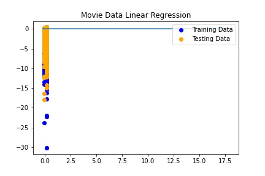

# Machine Learning

The purpose of this project was to use data from Kaggle and perform different machine learning analyses on it.

One analysis will take the data and use a few different machine learning tools to learn the movie's profitability based upon the genre and the description. The anticipated models are Logistic Regression, Random Forest, and Kera Neural Networks. Accuracy is the measure used to determine the model's performance. The webpage will hold graphs on the model's accuracy and the calculated profitability from a user-selected genre and narrative. 
A second analysis will test the hypothesis that the most profitable movies are English language movies. The models used will be Linear Regression, Random Forest Regressor, and Support Vector Regressor. Logistic Regression cannot be used as that is actually a classifier model and cannot be used in this example. The calculation of R squared will be used as a benchmark to compare all three models.

## Built With

* [Kaggle](https://www.kaggle.com/stefanoleone992/imdb-extensive-dataset?select=IMDb+movies.csv) - Data source for project

## Authors

* **Sean Galloway**
* **Eliot Chern**
* **Cora Micsunescu**

## Acknowledgments

* Our instructional team, Erik Conser and Andrew Morrison, for answering our questions during office hours.

